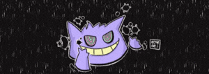

 

  

> *"Passionate about programming and dedicated to giving my best in everything I love.*
> *Currently studying Systems Analysis and Development at FACINT,*
> *with a focus on turning challenges into opportunities."*
>
> **Don't change the world for your desires; change yourself.**

<h2 align="center">👻 Shadow Skills</h2>

<h4>⚡ Current Stack</h4>

<h4>🎨 UI & UX</h4>

<h4>🛠️ Tools & Automation</h4>

<h4>📚 Currently Studying</h4>

<h2 align="center">🔮 Let's Connect</h2>

